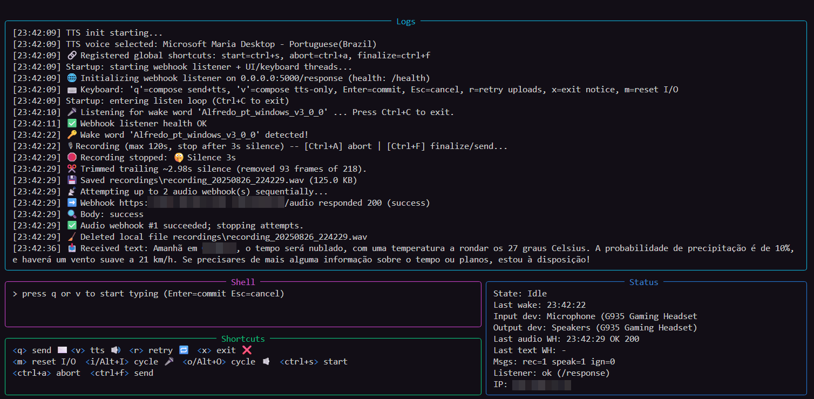

# ButlerBox

### The wake‑word butler that lives on your box, hears you locally, and reaches outside to orchestrate web automations.

Offline wake phrase detection → smart recording → resilient uploads → bidirectional text ↔ speech. A Rich terminal UI, rotating file logs, and live metrics make it a tidy self‑hosted concierge for workflows (home automation, n8n , personal AI agents, etc.).



_“Hey Alfredo...” and your local box becomes a gateway._

<!-- Badges (customize once public) -->
  

---

> [!WARNING]  
> Parts of this project were AI‑generated; verify details for your environment (tested on Windows).

---


## ✨ Highlights

- 🔊 **Offline wake word** via Picovoice Porcupine (low latency, no cloud round trip)
- 🗣️ **Adaptive recording**: silence end detection + max duration safety cap
- 📤 **Robust uploads**: sequential webhook failover + exponential backoff + jitter
- 🔁 **Retry queue** for failed audio (press mapped retry key)
- 📨 **Manual text → TTS & webhook** (send + speak or speak‑only modes)
- 📥 **Inbound `/response` endpoint** to speak remote text (e.g. LLM or automation output)
- 🧹 **Text normalization** (URL strip, noise symbol collapse, repeated punctuation squeeze)
- 🎚️ **Device cycling & recovery** (hot‑swap resilient; restart mic and speaker on demand)
- 🖥️ **Rich TUI** with panels: Logs / Shell / Shortcuts / Status (bouncing marquee for long device names)
- 🧪 **Health self‑test** + optional waitress fallback if Flask dev server fails
- 📊 **Live metrics**: received / spoken / ignored messages, listener health, endpoint & local IP
- 🗃️ **Rotating file logging** (persistent history + in‑memory tail)
- 🛠️ **Configurable local & global shortcuts** (with remapping in `config.yaml`)
- 🧩 **Pluggable sound cues** (custom WAV per event or fallback beeps)
- 🔐 **Local‑first** (no cloud audio handling unless you choose endpoints)

Fast wake, clean audio trimming, resilient delivery — all on your own box.
## 🔐 Security & Hardening

| Risk | Mitigation |
|------|------------|
| Open listener accessible on LAN | Bind `host: 127.0.0.1` or firewall rule |
| Unauthenticated `/response` misuse | Add reverse proxy token / shared secret header (future built‑in optional auth) |
| Sensitive wake phrase | Use uncommon/ custom trained `.ppn` |
| Log PII in rotating file | Set lower verbosity; consider future structured redaction |
| DOS via rapid inbound text | Potential queueing / throttling (roadmap) |

---

## 🛣️ Roadmap (Planned / Ideas)

- Auth token & HMAC for `/response`
- TTS queue (ordered, no overlap)
- Colorized health (green/red) & rate metrics (msg/sec)
- Structured JSON logging option
- Device preference persistence (remember last chosen index)
- Plugin hooks (pre/post upload / pre speech)
- Cross‑platform packaging (PyInstaller)
- Alternative TTS backends (Edge / ElevenLabs) via strategy layer

Contributions & feature requests welcome via Issues/PRs once repo is public.

---

## ❓ FAQ

**Why Porcupine?**  Low CPU, offline, reliable wake phrase detection.

**Will this stream speech to cloud?**  Only if you configure outbound webhook endpoints that themselves do so. Core wake + TTS remain local.

**Can I run it headless?**  Yes. Rich UI is optional; logs still persist to file.

**Why are some shortcuts not remappable (Alt+I/O)?**  They rely on scan patterns for device cycling; kept fixed to avoid conflicts.

**Does output device cycling change TTS device?**  Currently informational (pyttsx3 driver constraints). Roadmap includes improved routing.

**How big can logs get?**  Single file capped by `max_bytes` then rotated (N backups). In‑memory log limited by `LOG_LIMIT` (configurable in code).

---

## 🤝 Contributing

Open an issue describing feature / bug. Provide logs (set `logging.level: DEBUG`) and steps. PR guidelines (proposed):
- Keep patches focused; update README where behavior changes
- Add config keys with defaults; avoid breaking existing YAML
- Prefer small, testable helpers to large multi‑purpose functions

Linting/tests (future) will be documented once added.

---

## 📜 License

Internal / Personal Project (define explicit license before public release). Ensure compliance with Picovoice SDK terms for wake word files & access keys.

---

## 🙌 Acknowledgements

- Picovoice Porcupine for offline wake word detection
- Text normalization ideas inspired by common TTS hygiene practices
- Rich library for ergonomic terminal UI

---

Happy automating — Your box just got a butler.

## Features

- Offline Porcupine wake word detection (low latency)
- Silence-based endpointing with configurable threshold & window
- Max duration cap as safety limit
- Sequential audio webhook failover (`audio_webhooks`) – stops on first 200
- Separate text webhook list (`text_webhooks`) for manual commands
- Background audio upload & deletion on success
- Automatic exponential retry with jitter for both audio & text webhooks (configurable)
- Retry previously failed audio uploads (`r` key) with queue tracking
- Inbound Flask endpoint to speak returned text (ignores blank payloads)
- Automatic text cleanup for TTS (strips URLs, collapses noisy symbol clusters, trims repeated punctuation)
- Configurable recording shortcuts: abort & finalize/send mid‑record (console)
- Optional manual start recording shortcut (bypass wake word)
- Optional system‑wide (global) abort/finalize shortcuts (requires `keyboard` module)
- Robust audio device disconnect handling (auto-reopen & resume when device returns)
- Simple per-utterance TTS threads (pyttsx3) (best-effort concurrency)
- Custom or fallback beep event sounds

## Requirements

Python 3.8+ (tested on Windows). Install dependencies:

```powershell
pip install -r requirements.txt
```

You also need:

- A Picovoice (Porcupine) Access Key from https://console.picovoice.ai/
- Your trained keyword file (`*.ppn`) and matching model parameters file (e.g. `porcupine_params_pt.pv`)

## Configuration (`config.yaml`)

Current structure (abridged example):

```yaml
access_key: "YOUR_PICOVOICE_ACCESS_KEY"
wakeword_path: "Alfredo_pt_windows_v3_0_0.ppn"
model_path: "porcupine_params_pt.pv"

recording:
  silence_threshold: 500          # int16 peak amplitude below => silence
  silence_duration_seconds: 5     # continuous silence to stop
  max_record_seconds: 120         # hard cap
  output_dir: "recordings"        # temp storage before upload deletion

# Audio upload targets (tried in order until one returns 200)
audio_webhooks:
  - url: "https://primary.example.com/webhook/audio"
    timeout_seconds: 10
    file_field_name: "audio_file"
  - url: "https://fallback.example.com/webhook/audio"
    timeout_seconds: 30
    file_field_name: "audio_file"

# Text webhook targets (manual 'q' JSON posts); first 200 wins
text_webhooks:
  - url: "https://primary.example.com/webhook/text"
    timeout_seconds: 10
  - url: "https://fallback.example.com/webhook/text"
    timeout_seconds: 30

audio_feedback:
  enabled: true
  events:
    wake_detected: null
    recording_stopped: null
    webhook_success: null
    webhook_failure: null

tts:
  rate: 250
  voice_name: "Microsoft Maria Desktop - Portuguese(Brazil)"
  voice_index: 1
  debug: true

webhook_listener:
  host: 0.0.0.0
  port: 5000
  endpoint: /response  # POST {"text": "..."}

# Global webhook retry policy (applies to audio & text webhooks)
webhook_retry:
  max_attempts: 5           # total attempts including first
  base_delay_seconds: 1     # initial backoff
  backoff_factor: 2         # exponential growth
  max_delay_seconds: 20     # ceiling for delay
  jitter: true              # +/-25% random variance

# Recording control shortcuts
shortcuts:
  start_recording: "Ctrl+D"      # Start a recording immediately (no wake word)
  abort_recording: "Ctrl+A"      # During recording: discard captured audio
  finalize_recording: "Ctrl+S"   # During recording: immediately finalize & upload
  use_global: true                # If true, also register system-wide (global) hotkeys
```

### Key Parameters

- `silence_threshold`: Tune based on your microphone noise floor. Typical values 300–1200.
- `silence_duration_seconds`: Increase if you speak with long pauses.
- `max_record_seconds`: Safety upper bound (e.g., 120s).
- `output_dir`: Temporary storage before (possible) deletion.
- `audio_feedback.events.*`: Provide WAV file paths for custom sounds; leave `null` for built-in beeps.

## Running

1. Edit `config.yaml` with your access key and file paths.
2. Run the listener:

```powershell
python main.py
```

3. Speak the wake word. After the beep, talk. Stop speaking; when silence limit is hit or max time reached, another beep plays. Upload occurs in background.

4. On a successful webhook (HTTP 200) you hear the success beep and the local file is deleted. On failure the file remains for inspection/retry.

### Keyboard Commands (Windows console)

When the script is running:

- `q` : Prompt for text, speak it AND send JSON `{text: ...}` to first successful `text_webhooks` endpoint
- `v` : Prompt for text, speak locally only (no outbound send)
- `r` : Retry any previously failed audio uploads
- `x` : Print exit notice (Ctrl+C actually stops program)

### Recording Shortcuts (During Active Recording)

While a recording is in progress (after wake word until stop condition):

- Abort shortcut: Immediately stops & discards the current recording (no file/upload).
- Finalize shortcut: Immediately stops, saves & uploads (skips waiting for silence / max time).

Console versions work only while the terminal window has focus. They support:
1. Single character (e.g. `a`)
2. `Ctrl+<letter>` (e.g. `Ctrl+A`)
3. Multi‑character sequences (e.g. typing `stop`) – console only.

Global versions (if `shortcuts.use_global: true`) currently support only single characters and `Ctrl+<letter>`; multi‑character sequences are ignored globally. Global presses are ignored (no output) when no recording is active.

### Global Hotkeys (Optional)

Set `shortcuts.use_global: true` and install the `keyboard` Python package (already listed in requirements). On Windows this may require running the terminal as Administrator. If the module or permissions are unavailable, the program gracefully falls back to console shortcuts.

If `start_recording` is defined it can also be global (single key or `Ctrl+<letter>`). Pressing it begins a recording immediately (plays the wake beep) exactly as if the wake word had been detected. Ignored if a recording is already active.

### Webhook Retry Policy

Both audio and text webhook POSTs use the shared `webhook_retry` settings. Each individual webhook is attempted up to `max_attempts` with exponential delay: `delay = base_delay_seconds * backoff_factor^(attempt-1)`, capped by `max_delay_seconds`, then jittered (+/-25%). Audio webhooks try the next endpoint only after exhausting retries on the current one. Text webhooks stop at the first success.

### Text Cleanup

Inbound (and manually entered) text destined for TTS is sanitized:
- Markdown links `[label](url)` -> `label`
- Raw `http(s)://` and `www.` URLs removed
- Clusters of noisy symbols (`@#$%^&*+|<>[]{}` etc.) collapsed to spaces
- Repeated punctuation like `!!!` or `???` reduced to a single character
- Extraneous whitespace collapsed

Original text is still printed before the cleaned version is spoken.

### Audio Device Resilience

If the input device disappears (e.g., unplugging a headset), the program enters a silent retry loop, enumerating devices on first failure and reattempting to open until one succeeds. Recording and wake detection automatically resume once the device is back with a short stability check (ensuring real audio frames before declaring recovery).

### Inbound Text → Speech

The embedded Flask server listens on `/response` (configurable). POST JSON:

```json
{"text": "Olá mundo"}
```

It is queued for speech immediately without blocking the wake loop.

### Webhook Failover

`audio_webhooks`: Tried sequentially until one returns HTTP 200 (otherwise file kept for retry).

`text_webhooks`: Tried sequentially for manual text; stops on first HTTP 200. (Blank or whitespace text is ignored before speaking.)

### TTS Notes

Each utterance spawns a short-lived pyttsx3 engine thread. Rapid bursts of
messages from the inbound webhook may overlap and occasionally produce
`TTS error: run loop already started`; they are logged and skipped. If you need
guaranteed ordering without overlap, implement a single-thread queue.

## Webhook Contracts

Audio: `multipart/form-data` with field name from `file_field_name` (default
`audio_file`) containing WAV bytes. HTTP 200 => success (delete local file).

Text (manual): JSON `{"text": "..."}`; first 200 halts further attempts.

Inbound (listener): POST JSON `{"text": "..."}` to `/response`; blank or missing
`text` is ignored (204). Non-blank is spoken.

## Custom Sounds

Provide short `.wav` files (mono or stereo) for any event. Update the corresponding path in `config.yaml`. If a file is missing or cannot be played a fallback Beep is used (Windows `winsound`).

## Notes / Troubleshooting

- If you get `OSError: [Errno -9996] Invalid input device`, specify the correct input device index in the code (can be added if needed) using PyAudio's device enumeration.
- Adjust `silence_threshold` if recordings end too early or too late.
- The previous `soundfile` int64 dtype issue is avoided by writing raw 16-bit PCM via the `wave` module.
- If you need to change the wake keyword/model at runtime you must restart the script (Porcupine context is created once).

## Possible Enhancements

- Single-threaded TTS queue for strict ordering
- Structured logging / JSON logs
- Rich status UI / tray indicator
- Optional external VAD integration for earlier endpointing
- Configurable device selection & hot-swap prioritization

## License

Internal / Personal Project (add your desired license terms here).
